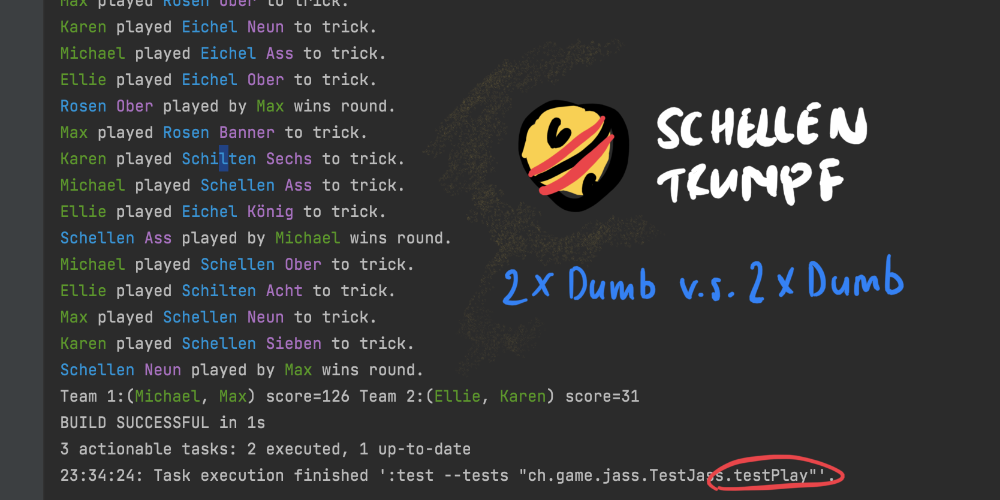

#    *lib*

Version: 0.0.11

## 🖊️ Todo

1. Add Wis
2. Make an intelligent player

# 🔨 How to Build

The project uses Gradle as a build system and was developed using IntellJ IDE.
To get started clone the repository and import it into intelliJ. 

There is a CLI names `JassCLI` which you can run to play Jass from the
command line. 

# 🙋 Contribute

If you want to contribute, it would be easiest to start by adding new `Junit` tests. 

## Example Usage 

See https://github.com/maebli/jass-cli for an example usage

## Example Output of tests

