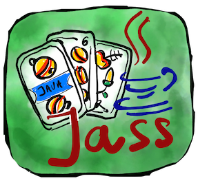

#  jass-lib 
Version: 0.0.6

## 🖊️ Todo

1. Add Wis
2. Add "Schiebä" as option
3. Make sure person with "Panner 10" starts
4. Add "help"
5. Publish artifact

# 🔨 How to Build

The project uses Gradle as a build system and was developed using IntellJ IDE.
To get started clone the repository and import it into intelliJ. 

There is a CLI names `JassCLI` which you can run to play Jass from the
command line. 

# 🙋 Contribute

If you want to contribute, it would be easiest to start by adding new `Junit` tests. 

## Example Usage 

See https://github.com/maebli/jass-cli for an example usage

## Example Output of tests

```
Max chooses mode 0
 Round 1
Max played Eichel Sieben to trick.
Hans played Eichel König to trick.
Michael played Eichel Acht to trick.
Ellie played Eichel Ober to trick.
Eichel König played by Hans wins round.
 Round 2
Hans played Rosen Ass to trick.
Michael played Rosen Unter to trick.
Ellie played Rosen Sieben to trick.
Max played Rosen König to trick.
Rosen Ass played by Hans wins round.
 Round 3
Hans played Rosen Ober to trick.
Michael played Rosen Sechs to trick.
Ellie played Schellen Ass to trick.
Max played Rosen Acht to trick.
Rosen Ober played by Hans wins round.
 Round 4
Hans played Eichel Ass to trick.
Michael played Eichel Sechs to trick.
Ellie played Eichel Unter to trick.
Max played Eichel Banner to trick.
Eichel Ass played by Hans wins round.
 Round 5
Hans played Schellen Sechs to trick.
Michael played Schellen Unter to trick.
Ellie played Schellen König to trick.
Max played Schellen Sieben to trick.
Schellen König played by Ellie wins round.
 Round 6
Ellie played Schellen Banner to trick.
Max played Schellen Acht to trick.
Hans played Schellen Neun to trick.
Michael played Schilten Banner to trick.
Schellen Banner played by Ellie wins round.
 Round 7
Ellie played Eichel Neun to trick.
Max played Schilten Ass to trick.
Hans played Rosen Banner to trick.
Michael played Schilten König to trick.
Eichel Neun played by Ellie wins round.
 Round 8
Ellie played Schilten Unter to trick.
Max played Schilten Sieben to trick.
Hans played Rosen Neun to trick.
Michael played Schilten Sechs to trick.
Schilten Unter played by Ellie wins round.
 Round 9
Ellie played Schilten Acht to trick.
Max played Schilten Ober to trick.
Hans played Schellen Ober to trick.
Michael played Schilten Neun to trick.
Schilten Ober played by Max wins round.
Team 1:(Michael, Max) score=19 Team 2:(Ellie, Hans) score=138
Cards 
```